```{=html}
<style>
@font-face {
  font-family: 'MyBigEnglish';
  src: local('Times New Roman');
  size-adjust: 115%; /* 核心在这里：把纯英文字体放大到 115% */
}
</style>
```

---
title: "Books"
editor: 
  markdown: 
    wrap: 100
format:
  html:
    fontsize: 18px
    mainfont: "'MyBigEnglish', 'HuaWenFangSong',  serif"
    grid:
      body-width: 900px  /* 核心修改：把主体宽度从默认的 800px 放大 */
      margin-width: 400px /* 可选：给右侧的目录导航栏预留的宽度 */
---

------------------------------------------------------------------------

这些书稿是由我许多数学课上课时的笔记讲义整理而成的，尚未完稿。大家在阅读过程中，若发现错误或表述不妥之处，烦请邮件告知我，以便完善。我的邮箱：[rieszyhx\@mails.ccnu.edu.cn](mailto:rieszyhx@mails.ccnu.edu.cn){.email}。


# Lectures

- <a href="lecture/数学分析讲义.pdf" target="_blank" >数学分析讲义：PDF</a>
- <a href="lecture/数学分析习题讲义.pdf" target="_blank" >数学分析习题讲义：PDF</a>
- <a href="lecture/AbstractAlgebraLecture.pdf" target="_blank" >抽象代数讲义：PDF</a>
- <a href="lecture/抽象代数习题讲义.pdf" target="_blank" >抽象代数习题讲义：PDF</a>
- <a href="lecture/复变函数讲义.pdf" target="_blank" >复变函数讲义：PDF</a>
- <a href="lecture/高等代数讲义.pdf" target="_blank" >高等代数讲义：PDF</a>
- <a href="lecture/高等代数习题讲义.pdf" target="_blank" >高等代数习题讲义：PDF</a>
- <a href="lecture/实分析习题讲义.pdf" target="_blank" >实分析习题讲义：PDF</a>
- <a href="lecture/拓扑学笔记.pdf" target="_blank" >拓扑学讲义：PDF</a>

## Note

- 夫祸患常积于忽微，而智勇多困于所溺。是以君子戒慎乎其所不睹，恐惧乎其所不闻。莫见乎隐，莫显乎微，故君子慎其独也。


# Course Books

## Mathematical Analysis

The importance of the mathematical analysis is self-evident, and it is the foundation of all the other branches of mathematics. It is the first course for students majoring in mathematics. No one can assert he/she has already learned mathematical analysis without problems, meanwhile , trapped in the deepth and the breadth of the knowledge,books in this course often divide into two factions, one is the classical style , focus on traditional differential and integral theory in one variable or two,three variables.And the difficulties and predicaments are obvious, students can not learn the modern techniques,and many theorems can not be strictly expressed if without the modern framework.Hence another faction express itself, however ,these books are often difficult for first learning students, but I think if learners have spare capacity to learn these books, they can get more benefits from it, and it is also a good choice for students who want to learn analysis in depth.

Following are the books and the exercise books.Classical style books I only recommend the book by ShiJi Huai,and you can buy it in latest forth version!. A little difficult book is by MeiJia Qiang.Then the modern style books are by Lou and YuPin. Sincerely maybe the latter two books are always be criticized, but without doubt,they are the good modern style books. Finally I want to recommend the exercise books, they are by XieHui Min and XuSen Lin, they are the best exercise books for mathematical analysis. But extremely heart-breaking, the Professor Xie passed away on September 2025.You can find the biography in the Webiste:[R.I.P ——HuiMin Xie](https://math.suda.edu.cn/48/22/c10866a673826/page.htm)

::: {style="text-align: center;"}
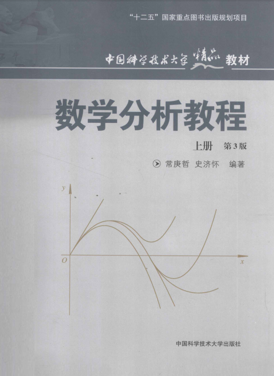{height="250px" style="margin: 0 10px;"} {height="250px" style="margin: 0 10px;"} 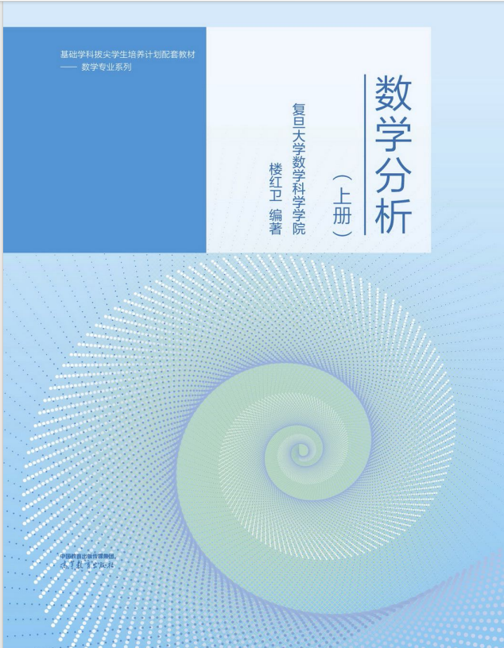{height="250px" style="margin: 0 10px;"} 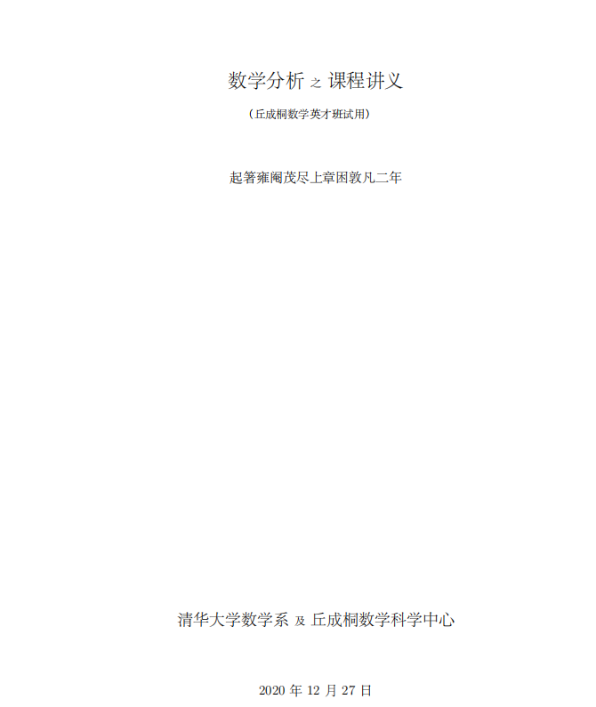{height="250px" style="margin: 0 10px;"}
:::

::: {style="text-align: center;"}
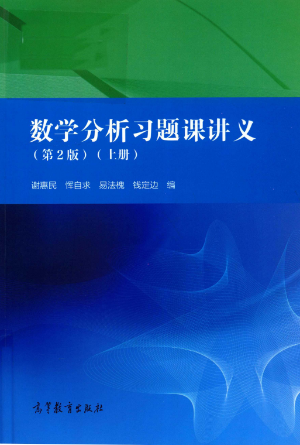{height="250px" style="margin: 0 10px;"} 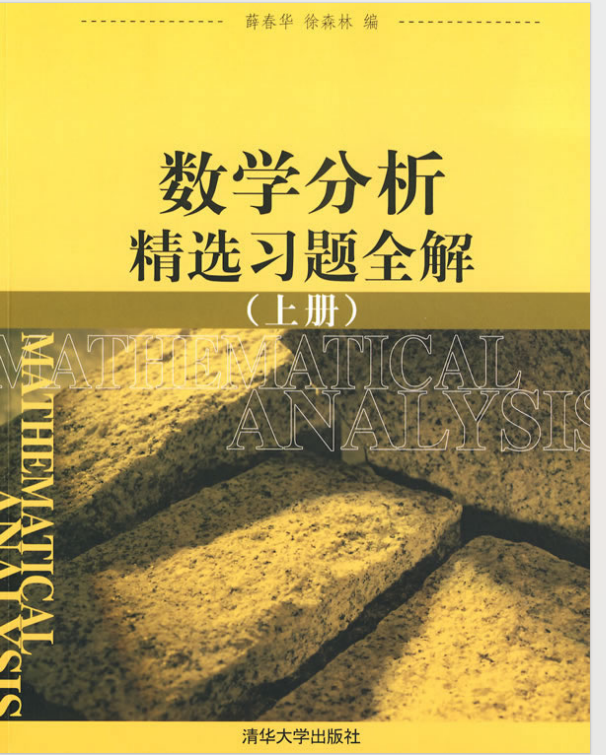{height="250px" style="margin: 0 10px;"}
:::

------------------------------------------------------------------------

## Advanced Algebra

In fact, this course is always be learned with the mathematical analysis meanwhile. I think as so far,there are no extroadinary books domestically. But only one book is worth recommending.The author is from FuDan University——Professor QiHong Xie ,ShengMu Yao!

::: {style="text-align: center;"}
{height="250px" style="margin: 0 10px;"} {height="250px" style="margin: 0 10px;"} {height="250px" style="margin: 0 10px;"}
:::

You can find the video course in website:[QIHong Xie's Class Video](https://www.bilibili.com/video/BV1mJ411r7ZB/?spm_id_from=333.337.search-card.all.click&vd_source=869a86d44af9d5fb96ae29b4cc418522)

You can find the blog of the Profrssor Xie in website:[Blog of the Xie](https://www.cnblogs.com/torsor/p/16850640.html)

------------------------------------------------------------------------

## Topology
It is the basic course in analysis and gemetry, anyway, also be called "Point Topology".So it is proper to learn it when you finish your first year of your undergraduate study. Following are the books I recommend.

::: {style="text-align: center;"}
{height="250px" style="margin: 0 10px;"} {height="250px" style="margin: 0 10px;"}
:::


------------------------------------------------------------------------


## Real-Analysis

We want to recommend some books for Real-Analysis.It is always the first course for students who want to learn analysis. It is significant that exercises behind the chapter in rudin's book are difficult for the first learning-students,hence if you are trapped in these problems,it is not your wrong.

::: {style="text-align: center;"}
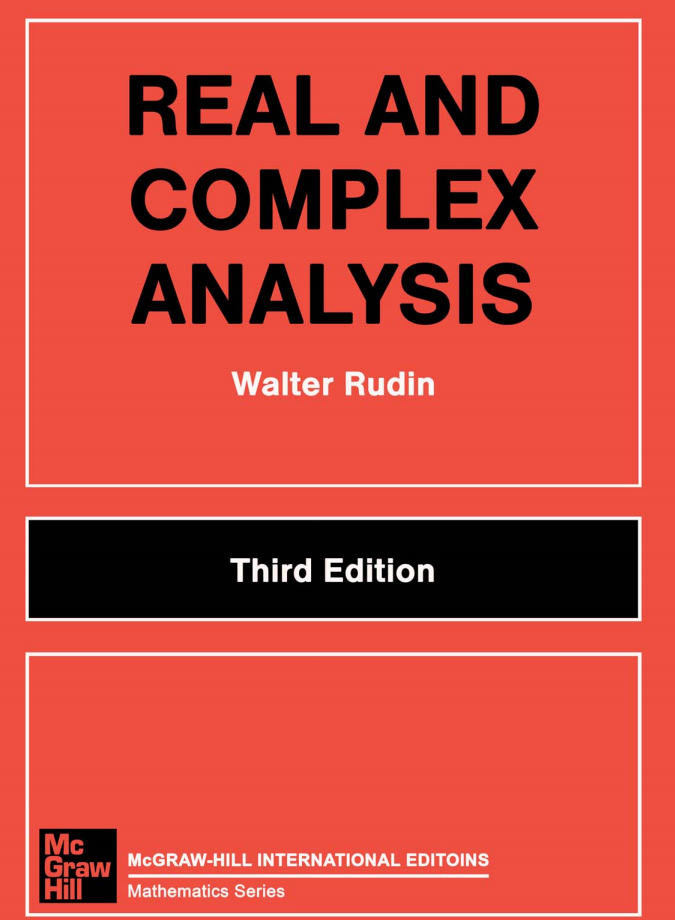{height="250px" style="margin: 0 15px;"} 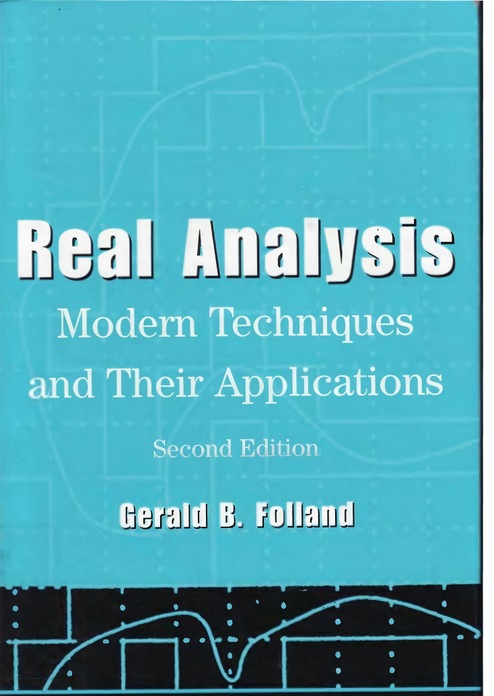{height="250px" style="margin: 0 15px;"} {height="250px" style="margin: 0 15px;"}
:::

- <a href="lecture/Measure Theory (Donald L. Cohn) .pdf" target="_blank" >Measure Theory讲义：PDF</a>

- <a href="lecture/Real Analysis(Gerald B. Folland) .pdf" target="_blank" >Folland-Real Analysis：PDF</a>

- <a href="lecture/Real And Complex Analysis(Rudin).pdf" target="_blank" >Rudin-Real And Complex Analysis：PDF</a>

------------------------------------------------------------------------

## Abstact Algebra

For abstract algebra,sincerely there are too many extraordinary books,so we just recommend some of them.I think the most widely used one is the book by Hungerford(GTM73),and I recommend the other book is the "Algebra Chapter 0" by Aluffi,it opens the category theory to the readers who want to learn algebra.For Chinese language users, the book "Abstract Algebra" by ShaoQiang Deng , who is the professor in NanKai University, and to learn it you can use the video course on Bilibili by Professor PeiGU.The style of the class is well-known by deep and rich in details.Finally is the book by LingZhao Nie and ShiSun Ding.

You can find the video by [Pei Gu's Class](https://www.bilibili.com/video/BV1qG4y1B74U/?spm_id_from=333.337.search-card.all.click)

::: {style="text-align: center;"}
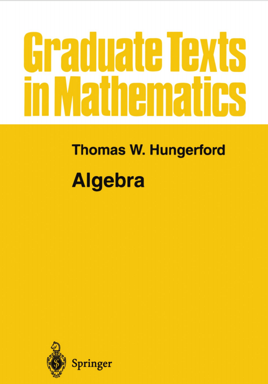{height="250px" style="margin: 0 10px;"} 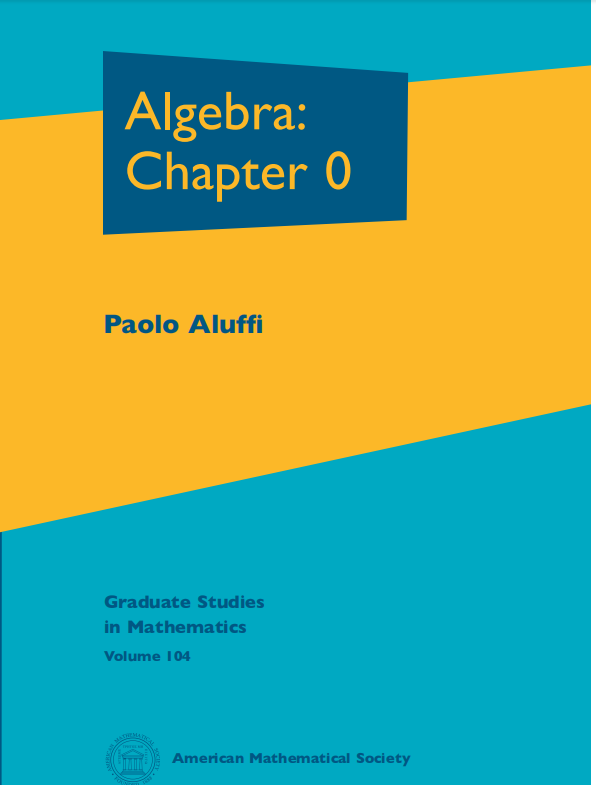{height="250px" style="margin: 0 10px;"} {height="250px" style="margin: 0 10px;"} {height="250px" style="margin: 0 10px;"}
:::

------------------------------------------------------------------------

## Fuctional Analysis

For fuctional Analysis, I recommend the four books,two book in Chinese are by professor GongQing Zhang and the latest published book by professor Kai Wang,YiJuan Yao,ZhaoBo Huang from DanFu University,I think it is the most practical book for the first learning students. Additionally, in English ,the book by John.B Conway is widely used around the world, the other book is the "Functional Analysis" by Dietmar A. Salamon.

::: {style="text-align: center;"}
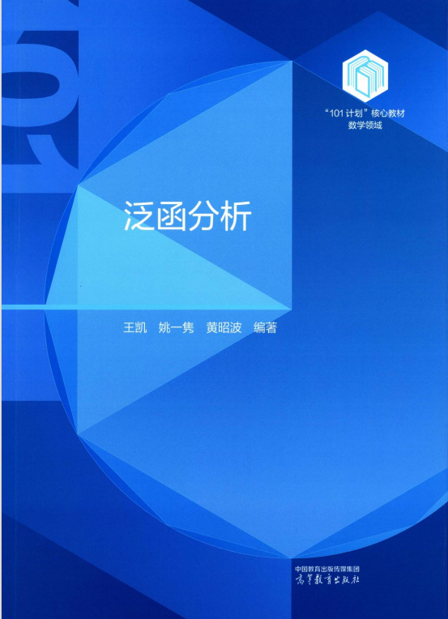{height="250px" style="margin: 0 10px;"} 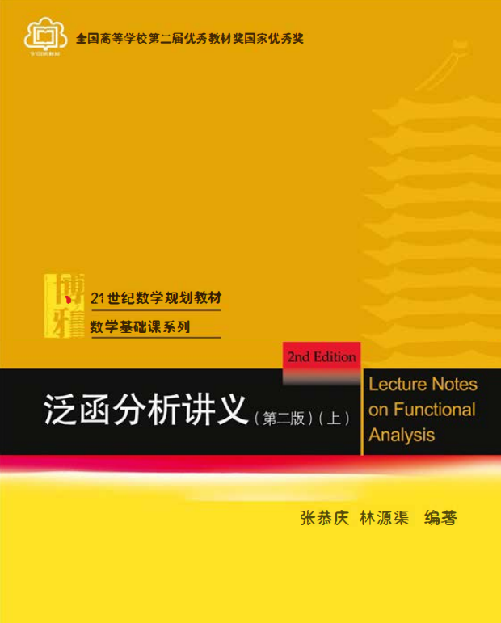{height="250px" style="margin: 0 10px;"} 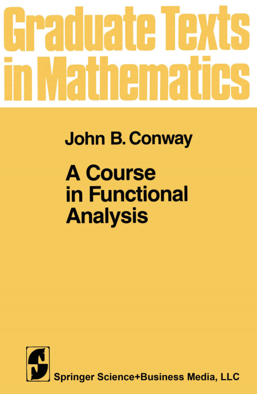{height="250px" style="margin: 0 10px;"} 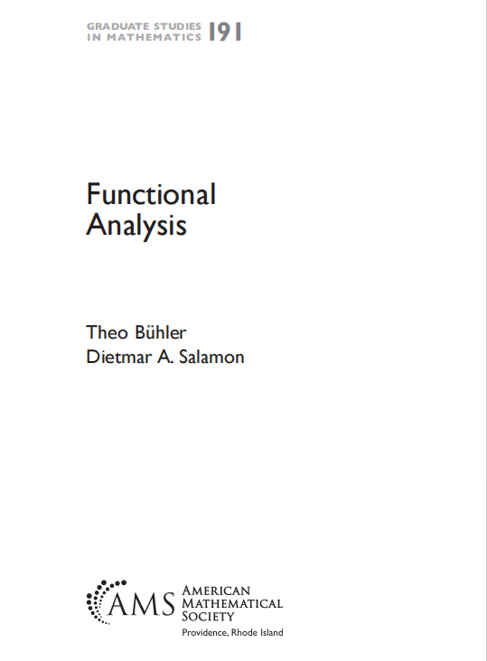{height="250px" style="margin: 0 10px;"}
:::

------------------------------------------------------------------------

## Note
- 人心惟危，道心惟微，惟精惟一，允执厥中。


